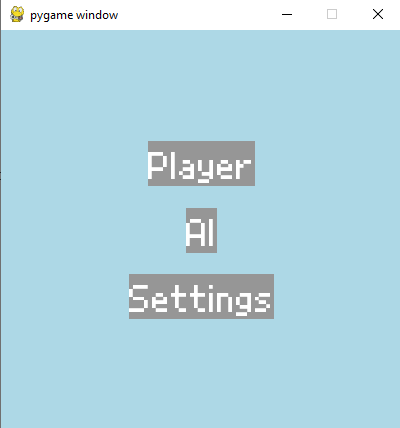

# Chohesion

## Group 02

### Requirements for the game

- Python 3.11.2
- pygame 2.3.0

### How to run the program

In order to run the game symply type the command ```python main.py``` on the terminal right after opening the project folder.

### What is displayed

After running the program the user will be presented with this window:



Figure 1: Main Menu

There are three options ont he main menu:

- Play
- AI
- Settings

In the first option the palyer will be presented with a 3x3 board with diferent pieces with diferent colors and sizes.
The main objective is to join the pieces with the same color in the least possible moves.

The second option will have specific algorithms to solve the puzzle automatically

### Group members

- Afonso Pinto up202008014
- Afonso Abreu up202008552
- Francisco Serra up202007723